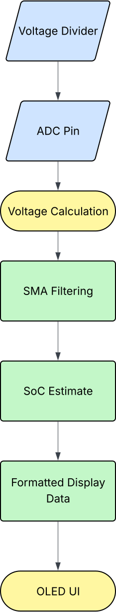

# Power Bank Controller
MicroPython code to control an OLED display that monitors battery health.

**Link to Project Demo:** *Coming Soon*
*(This project is a work in progress)*

## How It's Made
**Tech Used:** MicroPython, Raspberry Pi Pico, SSD1306 OLED Display

Eight 18650 batteries are wired in parallel to a boost converter charging module. The charging module powers the Pico Board and the OLED Display. To achieve battery health displays a voltage divider is used to safely bring down the voltage towards an ADC pin. The display is programmed to display the reported battery health percentage for the user. 

## Optimizations
Will cover:
- Improved wiring layout
- Practical design refinements
- Considerations for safety and reliability

## Lessons Learned
This was my first time soldering. I quickly learned the soldering process through soldering the Battery Case Holders to the Charging Module. This project also taught me the importance of solder flux, both for creating clean joints and for desoldering.

## Data Flow
A diagram showing how the Pico processes battery voltage and displays SoC info on the OLED screen.

    

<em>Figure 1: Data flow from ADC voltage reading to OLED UI output.</em>

## Circuit Diagram
A full schematic will be added soon.

## Included Modules
- 'bisect.py' - From the Python Standard Library (CPython 3.13)
- Source: https://github.com/python/cpython
- License: Python Software Foundation License (PSF)
