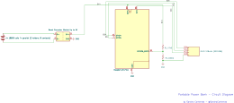

# Power Bank Controller
Custom 8-cell lithium-ion power bank with embedded monitoring via MicroPython and OLED display.

## Overview
This project is a custom 8-cell (8×18650) lithium-ion power bank controller designed to explore
high-current PCB design, USB-C power delivery behavior, and real-world manufacturing constraints.
The board was designed in KiCad and fabricated as a 2-oz copper PCB.

## Features
- 8× Sony/Murata VTC6 18650 cells in parallel (~86 Wh)
- USB-C power output via IP5310 power-bank SoC
- 2 oz copper PCB for high-current paths
- Per-cell polyfuse protection
- Raspberry Pi Pico for battery monitoring
- Designed for serviceable, replaceable cells

## How It's Made
**Tech Used:** MicroPython, Raspberry Pi Pico, SSD1306 OLED Display

Eight 18650 batteries are wired in parallel to a boost converter charging module. The charging module powers the Pico Board and the OLED Display. To achieve battery health displays a voltage divider is used to safely bring down the voltage towards an ADC pin. The display is programmed to display the reported battery health percentage for the user. 

## Design Decisions & Tradeoffs
- Used 18650 holders instead of spot-welded packs to improve safety and serviceability.
- Selected 2 oz copper to reduce voltage drop and thermal stress in high-current paths.
- Chose IP5310 to simplify power-bank control while accepting uncertainty around USB-PD behavior.
- Accepted larger PCB size to prioritize current handling and mechanical robustness.

## Future Work
- Improve wiring layout and enclosure integration
- Perform basic electrical and thermal validation under load
- Apply practical design refinements based on test results

## Lessons Learned
This was my first time soldering. I quickly learned the soldering process through soldering the Battery Case Holders to the Charging Module. This project also taught me the importance of solder flux, both for creating clean joints and for desoldering.

## Data Flow

    

<em>Data flow from ADC voltage reading to OLED UI output.</em>

## Circuit Diagram

    

<em>High-Level Circuit Diagram.</em>

    

<em>PCB Circuit Diagram.</em>
 

## Included Modules
- 'bisect.py' - From the Python Standard Library (CPython 3.13)
- Source: https://github.com/python/cpython
- License: Python Software Foundation License (PSF)
